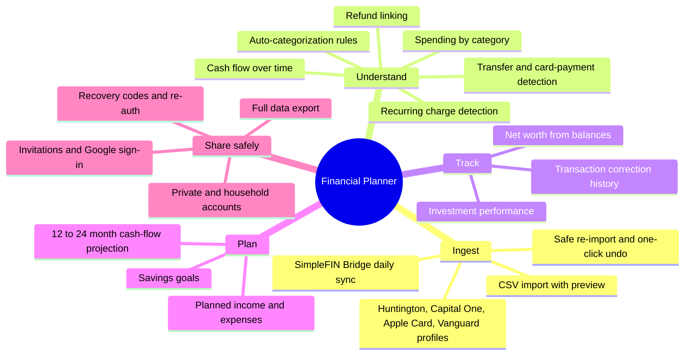
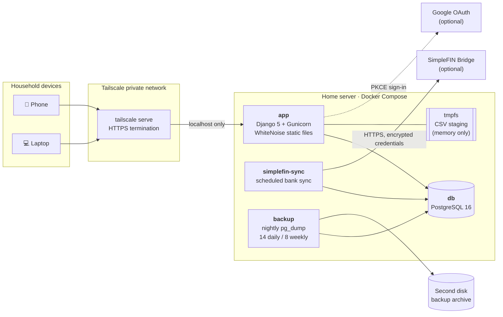
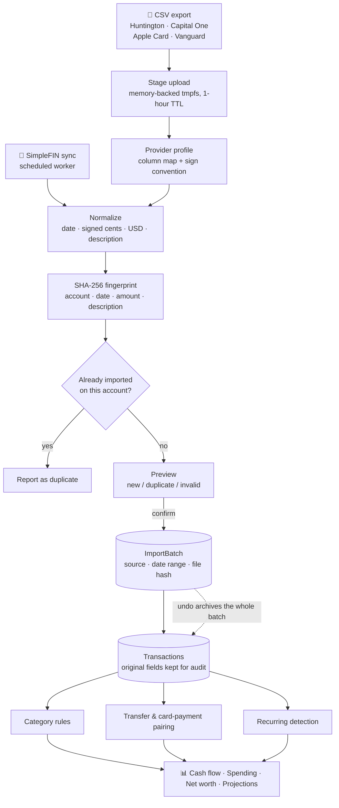
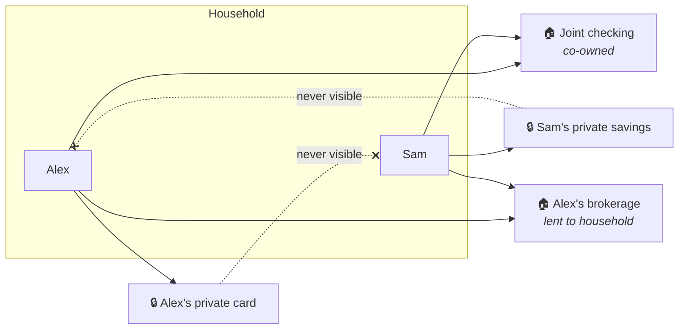
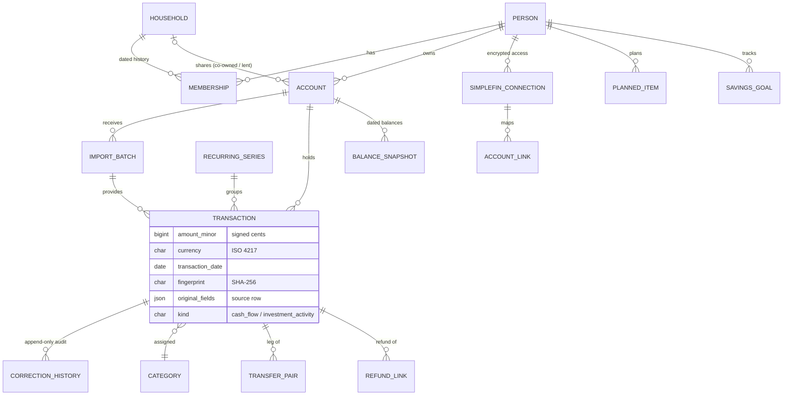
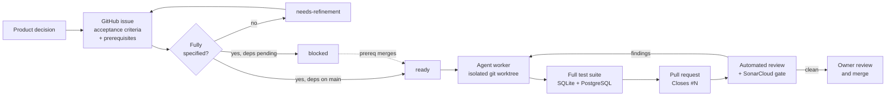

# Financial Planner

**A self-hosted, multi-user personal finance platform built to replace a paid budgeting subscription.**
It imports bank and card data, de-duplicates and categorizes it, and turns it into cash-flow, spending,
net-worth, investment, and forward-looking planning views, while keeping each person's private
accounts private inside a shared household.


| Status | Scope | Process |
|---|---|---|
| In production on a home server, used daily by a two-person household | ~11.8k lines of application code, ~15k lines of tests, 15 schema migrations | 45+ merged pull requests, each tied to a specified GitHub issue and reviewed before merge |

---

## Contents

- [What it does](#what-it-does)
- [System architecture](#system-architecture)
- [How data flows in](#how-data-flows-in)
- [Privacy and access model](#privacy-and-access-model)
- [Domain model](#domain-model)
- [Engineering highlights](#engineering-highlights)
- [Development workflow](#development-workflow)
- [Running locally](#running-locally)
- [Documentation](#documentation)

---

## What it does



| Area | Highlights |
|---|---|
| **Cash flow dashboard** | Income, spending, and net cash flow by period, with gaps flagged where an account has no import coverage. Projected months are appended to the chart and clearly labeled, never mixed into actuals. |
| **Imports** | Upload a CSV, preview new / duplicate / invalid rows, then commit. Provider profiles define column mapping and sign conventions. Every row keeps its batch provenance, so an entire import can be undone. |
| **Bank sync** | Optional [SimpleFIN Bridge](https://www.simplefin.org/) connection on a scheduled worker. Access URLs are encrypted at rest and never logged. |
| **Categorization** | Household-editable categories, rule-based auto-categorization with a reversible audit trail, and automatic pairing of transfers and credit-card payments so they never count as income or spending. |
| **Recurring charges** | A deterministic detector finds weekly through annual subscriptions, tolerates date drift and varying amounts, and reports monthly and annual cost. |
| **Net worth and investments** | Monthly net worth from balance snapshots, with carried-forward values flagged. Investment growth versus contributions using the Modified Dietz method. |
| **Planning** | Planned items and confirmed recurring series feed a month-by-month projection; savings goals track progress. |

---

## System architecture

The app runs as a Docker Compose stack on a Windows home server and is reachable only over a private
[Tailscale](https://tailscale.com/) network, which terminates HTTPS. Nothing is exposed to the public internet.



| Layer | Choice | Why |
|---|---|---|
| Web | Django 5.2, server-rendered templates | Built-in ORM, migrations, sessions, and auth; no SPA to maintain for a household app |
| UI | Tailwind CSS v4 + daisyUI 5, Chart.js | Modern, themeable UI (light and dark) compiled by Tailwind's standalone binary, so the repo has **no Node toolchain** |
| Data | PostgreSQL 16 | Durable, constraint-rich storage; integrity rules live in the schema, not just in code |
| Money | Integer cents (`BigInteger`) + ISO 4217 currency | Exact arithmetic, no floating-point drift anywhere in the pipeline |
| Auth | Django sessions, django-allauth (Google), recovery codes | Invitation-only household with password or Google sign-in and re-authentication for sensitive actions |
| Ops | Docker Compose, health checks, scripted backup/restore | Self-supervising stack with a documented, rehearsed restore drill |

---

## How data flows in

Two sources feed the same provenance-tracked transaction store. Both paths are idempotent: importing
the same data twice never double-counts.



---

## Privacy and access model

People in one household can share some accounts and keep others private. Every query for accounts,
transactions, balances, goals, and planned items goes through a single `visible_to(person)` layer,
so a private-account leak would require a defect in one place, not in every view.



<sub>Names and accounts above are illustrative only.</sub>

- **Private** accounts are visible only to their owner, including in search, totals, charts, exports, logs, and error messages.
- **Co-owned** household accounts belong to the household; ownership passes to a remaining member if the owner leaves.
- **Lent** household accounts stay owned by the lender and revert to private if they leave the household.
- Aggregates such as transfer pairing and recurring detection only consider rows visible to the person asking, so one member's private data cannot shape what another member sees.

---

## Domain model

A simplified view of the core entities (15 migrations, 26 model classes in total).



---

## Engineering highlights

**Correctness first**
- One sign convention for every account type (negative is money out, including credit cards), defined per importer and enforced by tests.
- Database `CHECK` constraints reject invalid scope/share-mode combinations, non-USD currency, and multiple open household memberships.
- Corrections and undo archive records instead of deleting them; every field edit writes an append-only history row in the same database transaction.
- Unverified investment activity is stored but kept out of income and spending until its meaning is confirmed. Projections are labeled and never mixed into actual totals.

**Security and privacy by design**
- Deny-by-default authentication middleware; only sign-in, setup, invitation, and recovery routes are public.
- Re-authentication gate for sensitive actions (export, account deletion, connection changes).
- Bank connection credentials encrypted with Fernet; uploaded CSVs staged on a memory-only filesystem and deleted after use.
- Imported row contents are never written to logs or error messages. All fixtures are synthetic.
- Login throttling, single-use recovery codes, and secure, HTTP-only, SameSite cookies over HTTPS.

**Algorithms worth a look**
- [`finance/csv_import/fingerprint.py`](finance/csv_import/fingerprint.py): overlap-safe re-import that still allows legitimate repeated purchases.
- [`finance/recurring_services.py`](finance/recurring_services.py): cadence-chain detection with amount clustering and outlier re-picking.
- [`finance/performance.py`](finance/performance.py): Modified Dietz investment returns from statement entries.
- [`finance/projection.py`](finance/projection.py): pure, month-by-month cash-flow projection.
- [`finance/net_worth.py`](finance/net_worth.py): monthly net worth with carry-forward and per-source sign handling.

**Testing and quality**
- 555 pytest tests across importers, authorization, reporting, deployment scripts, and UI.
- The suite runs on in-memory SQLite for speed and on a throwaway PostgreSQL 16 container ([`scripts/test_postgres.sh`](scripts/test_postgres.sh)) before every pull request.
- SonarCloud quality gate in CI on every pull request and push to `main` (coverage, security, maintainability), plus on-demand automated code review on a self-hosted GitHub Actions runner.
- Supply-chain care: pinned Python dependencies, a checksum-verified Tailwind binary, and vendored front-end assets with recorded SHA-256 sums.

---

## Development workflow

The project is built issue by issue with AI coding agents working under human direction, using a
structured pipeline (`agent-loop`) that keeps each change small, specified, and reviewed. Product
decisions are recorded in [`docs/requirements.md`](docs/requirements.md) before code is written.



- Every pull request maps to one issue with explicit acceptance criteria and listed prerequisites.
- Agents work in isolated worktrees and never merge; the owner approves every merge.
- Review findings are iterated until clean, and any deferred finding is filed as its own issue.

---

## Running locally

Requirements: Python 3.13, and Docker for PostgreSQL tests or the full stack.

```console
python -m pip install -r requirements.txt
python manage.py migrate --settings=financial_planner.test_settings
python -m pytest                  # fast suite on in-memory SQLite
bash scripts/test_postgres.sh     # same suite on PostgreSQL 16 (needs Docker)
```

Load synthetic demo records with `python manage.py loaddata synthetic_demo`. Never substitute a real
statement or transaction export into a committed fixture.

<details>
<summary><b>Configuration and first user</b></summary>

The normal settings use PostgreSQL environment variables documented in `financial_planner/settings.py`.
Authentication requires `DJANGO_SECRET_KEY`; production also needs the Tailscale HTTPS and host/origin
values described in [the authentication guide](docs/authentication.md).

After migrating a new installation, create its first household member:

```console
python manage.py seed_first_user --username USERNAME --display-name "DISPLAY NAME" --household "HOUSEHOLD NAME"
```

The command prompts for a password without echoing it and prints recovery codes once.

CSV preview temporarily stages uploads outside the repository. Set `CSV_IMPORT_STAGING_DIR` to a
private local directory; the default is the operating system's temporary directory.
`CSV_IMPORT_STAGE_TTL_SECONDS` defaults to 3600 and is capped at one hour. Uploaded source rows are not
logged, and staged files are deleted on cancel, rejected upload, expiry enforcement, and later
successful import work. In Docker Compose, staging uses a memory-backed tmpfs.

</details>

<details>
<summary><b>CSS without Node</b></summary>

Pages stay server-rendered. Tailwind's standalone binary is downloaded at a pinned version and its
SHA-256 is checked; daisyUI's plugin files are vendored under `static/src/vendor/` with recorded checksums.

```console
bash scripts/build_css.sh
bash scripts/build_css.sh --watch
```

The binary is stored under `.cache/tailwindcss/` (gitignored). `docker compose build` runs the same
pinned compile in a throwaway image stage, then `collectstatic` so WhiteNoise can serve the minified
`static/dist/app.css`. The Tailwind binary is not in the runtime image.

</details>

<details>
<summary><b>Production deployment</b></summary>

`docker compose up -d` starts four services: `db`, `app`, `simplefin-sync`, and `backup`. The app binds
to localhost only and is published to the tailnet with `tailscale serve`. See
[docs/deployment.md](docs/deployment.md) for first deployment, health checks, backups, restore into a
fresh volume, and upgrades.

</details>

<details>
<summary><b>Continuous integration</b></summary>

`.github/workflows/review.yml` posts an automated code-bug review as a PR comment. It runs only when a
maintainer dispatches it (`gh workflow run review.yml -f pr_number=N -f mode=full`), never automatically.
It refuses pull requests from forks, so untrusted code never reaches the dedicated self-hosted runner
(`financial-planner-review`, registered with `ops/github/install-runner.ps1`). See
`ops/review/run-review.ps1` for the review logic.

`.github/workflows/sonar.yml` runs the test suite with coverage and reports it to SonarCloud on every
push to `main`, on pull requests from branches of this repository, and on demand (`gh workflow run sonar.yml`).
It uses the `SONARCLOUD_TOKEN` repository secret, is skipped for pull requests from forks, and fails the
check when the SonarCloud quality gate fails (including 80% coverage on new code). A local SonarQube server
(`localhost:9000`) remains available as a pre-push check.

</details>

---

## Documentation

| Document | Contents |
|---|---|
| [Requirements](docs/requirements.md) | Goals and every recorded product decision |
| [Architecture](docs/architecture.md) | Stack choices with rationale and rejected alternatives |
| [Data model](docs/data-model.md) | Storage contract, import, transfer, recurring, and net-worth rules |
| [Authentication](docs/authentication.md) | Onboarding, invitations, recovery, and session security |
| [Deployment](docs/deployment.md) | Home server deployment, backup, and restore |
| [Backlog](docs/backlog.md) | Milestones and issue roadmap |
| [Account connections research](docs/research/account-connections.md) | SimpleFIN, Plaid, and alternatives |
| [Agent guide](AGENTS.md) | Rules for AI agents working in this repository |

## License and security

MIT. See [LICENSE](LICENSE). Report vulnerabilities privately as described in [SECURITY.md](SECURITY.md).
No real financial data is stored in this repository; all fixtures and examples are synthetic.
